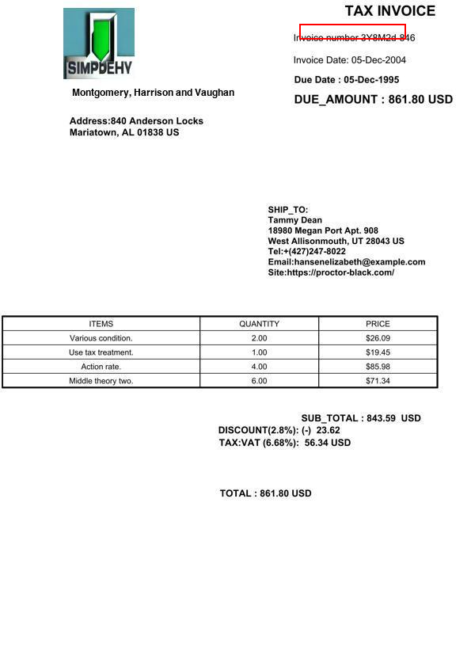

# DocExplainer

DocExplainer is a two-stage Visual Document Question Answering (VQA) pipeline that not only answers questions based on a document image but also provides visual **explanations** via bounding boxes that highlight supporting evidence.

Built using a **frozen Vision-Language Model (VLM)** for question answering and a fine-tuned **[SigLIP2](https://huggingface.co/google/siglip2-giant-opt-patch16-384)-based bounding box regressor**, DocExplainer is designed for **modular integration**, interpretability, and quick deployment.

> 📄 [View model card on Hugging Face](https://huggingface.co/letxbe/DocExplainer)  
> 📊 [BoundingDocs Dataset](https://huggingface.co/datasets/letxbe/BoundingDocs)

---

##  Experiments Reproducibility

This repository includes **example scripts** of DocExplainer to reproduce our experiments with:

- The [**BoundingDocs**](https://huggingface.co/datasets/letxbe/BoundingDocs) dataset — a curated benchmark for Document VQA with answer bounding boxes.
- Multiple Vision-Language Models (VLMs), including:
  - [`SmolVLM2-2.2B`](https://huggingface.co/HuggingFaceTB/SmolVLM2-2.2B-Instruct_)
  - [`Qwen2.5-VL-7B`](https://huggingface.co/Qwen/Qwen2.5-VL-7B-Instruct)
  - [`Claude Sonnet 4`](https://www.anthropic.com/claude/sonnet) (API required)

> **Note**: The example scripts in `src/dataset/` are for evaluation and experimentation purposes only and are not part of the main package distribution.
  
## Project Structure

```
DocExplainer/
├── images/                       # Sample images for demos and visualization
├── src/
│   ├── dataset/                     # Scripts for experiments reproducibility with BoundingDocs
│   │   └── ...
│   └── doc_explainer/            # Core DocExplainer package (main distribution)
│       ├── models/               # Helper methods to use DocExplainer with Smol, Qwen and Claude
│       │   └── ...         
│       ├── docexplainer.py       # Main DocExplainer class implementation
│       ├── metrics.py            # Evaluation metrics
│       ├── model.py              # Model utilities
│       ├── type.py               # Type definitions
│       └── utils.py              # Utility functions
├── pyproject.toml                # Package configuration
└── README.md                     # This file
```

## Quick Start
Here is a simple example of how to use `DocExplainer` to get an answer and its corresponding bounding box from a document image.

```python
from PIL import Image
import requests
from doc_explainer import DocExplainer

url = "https://i.postimg.cc/BvftyvS3/image-1d100e9.jpg"
image = Image.open(requests.get(url, stream=True).raw).convert("RGB")
question = "What is the invoice number?"

doc_explainer = DocExplainer(
    vlm_model_name='smolvlm',
)

result = doc_explainer([image], question)

if result:
    print(result)
    result.explain(image, save_path="example.png")
```

<table> <tr> <td width="50%" valign="top">
Example Output:

<strong>Question: </strong>What is the invoice number? <br>
<strong>Answer: </strong> 3Y8M2d-846<br><br>
<strong>Predicted BBox: </strong> [0.6353235244750977, 0.03685223311185837, 0.8617828488349915, 0.058749228715896606] <br>


</td> <td width="50%" valign="top">
Visualized Answer Location:

 </td> </tr> </table> 


## Evaluation on BoundingDocs

The repository includes scripts to evaluate the models on the test split of the [BoundingDocs](https://huggingface.co/datasets/letxbe/BoundingDocs) dataset.


### 1. Prompting Strategy Evaluation

This script evaluates the performance of a VLM using different prompting strategies, including zero-shot, chain-of-thought (CoT), and providing OCR-based anchor points. This mode assumes the VLM itself predicts the bounding box.

**How to run it:**  
```bash
python src/dataset/00_prompting.py --vlm-model smolvlm --mode cot
```

| Argument | Type | Description | Default | Supported Values |
| --- | --- | --- | --- | --- |
| `--vlm-model` | `str` | Name of the VLM model to use. | `smolvlm` | `smolvlm`, `qwen2.5-vl-7b`, `claude-sonnet-4` |
| `--mode` | `str` | Evaluation mode for prompting. | `zero_shot` | `zero_shot`, `anchors`, `cot` |
| `--draw-bbox` | `store_true` | Save images with ground-truth bounding boxes drawn. | `False` | |


### 2. Full DocExplainer Pipeline Evaluation

This script evaluates the end-to-end `DocExplainer` system, which includes both the VLM for answering and the `BoundingBoxExplainer` for localization.

**How to run it:**
```bash
python src/dataset/01_docexplainer_test.py --vlm-model smolvlm
```

| Argument | Type | Description | Default | Supported Values |
| --- | --- | --- | --- | --- |
| `--vlm-model` | `str` | Name of the VLM to use in the pipeline. | `smolvlm` | `smolvlm`, `qwen2.5-vl-7b` |


